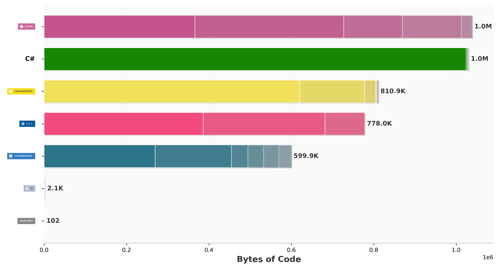
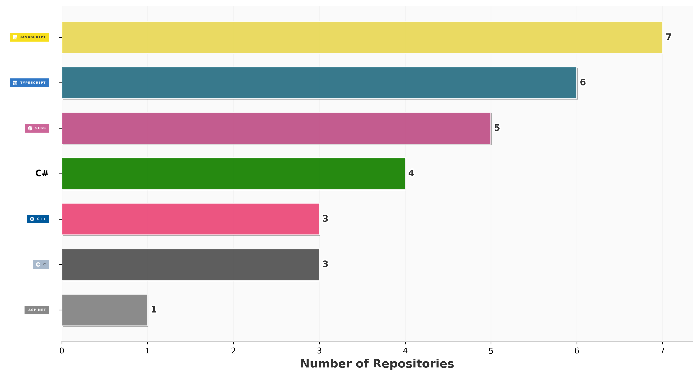
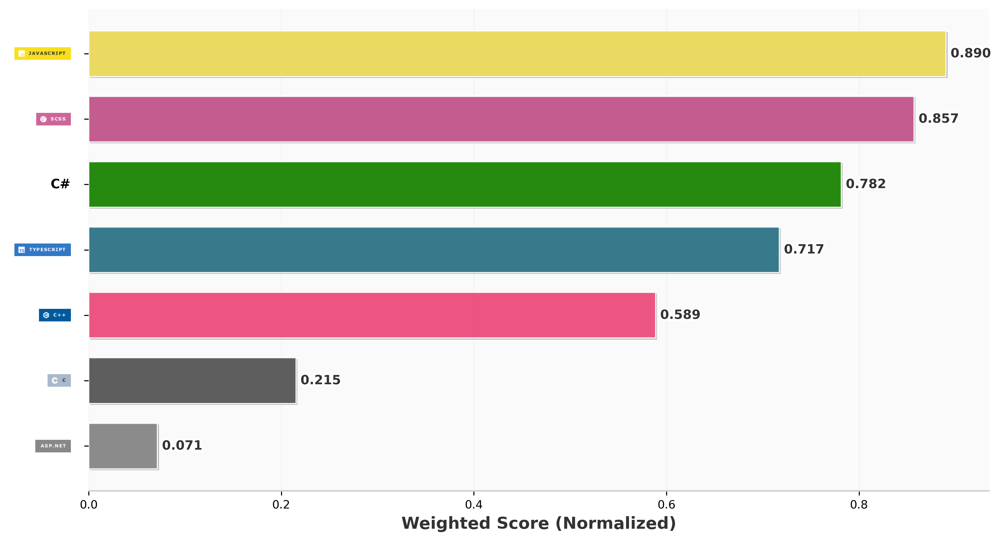

### 📊 Language & Development Statistics (Including Private Repos)

The charts below display the distribution and volume of code written across all my public and private repositories, updated automatically:

| 💻 Languages by Volume (Bytes Written) | 🗂️ Distribution by Repository Count |
| :---: | :---: |
|  |  |

  <b>⚖️ Weighted Language Impact</b> 
  

